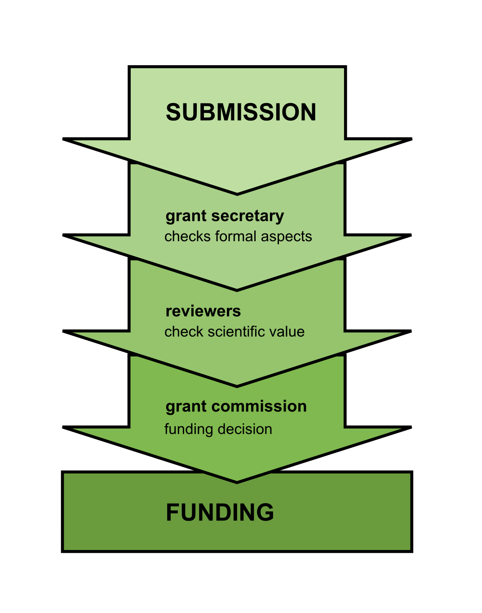

# From Grant Submission to Acceptance

You need funding for your research. You have found a host institution that will gladly give you a place to work if you bring the money. You have written a grant proposal and submitted it. What happens then? This article gives an overview of the main steps:

### The grant secretary

The grant secretary is responsible for the paperwork. They check the application from a formal point of view: Whether it is on time, complete, and whether you as an applicant are eligible.Although the grant secretary does not decide on grants, they have subtle influence on the process insted. When applying for funding it is a good idea to stick to the guidelines strictly, because it makes the secretary's work easier.

### Reviewers

They read your application, evaluate how sound your proposal is and whether you are the right person to do the project. Afterwards they write a report that is passed to the committee. Review of grant proposals has a big difference to reviews of paper submissions: You usually cannot correspond with grant reviewers - you have just one chance to convince them. Referees are usually scientists with regular academis duties. Put yourself in their shoes: 

**If you were a reviewer, what would be likely to convince you?**

### The Grant Committee

A grant committee meets regularly and decides which proposals to fund. They distribute funding based on the reviews. Because the committee usually has a lot of proposals to consider during a meeting it is unlikely that members will read your entire application. To stand out in the commissions' eyes it certainly helps to have a clear summary and a great first sentence.

### Summary

Taken together, once your application arrives at the grant agency, it lands of the desk of a secretary. The grant secretary checks whether your application is formally valid. Once valid, the application is assigned to a commission and sent to reviewers. The reviewers evaluate the scientific part of the application and write a report. When the reports have been completed, the commission makes the final decision in a meeting.

This process is valid for most PhD and postdoc fellowships and many smaller grants e.g. travel fellowships. Some funding bodies (e.g. the DFG) include an extra evaluation by a smaller board. Big grant applications, e.g. for research groups or international research consortia may include two rounds of application.

Knowing what will happen to your proposal after submission is crucial to address the people who read it properly.
