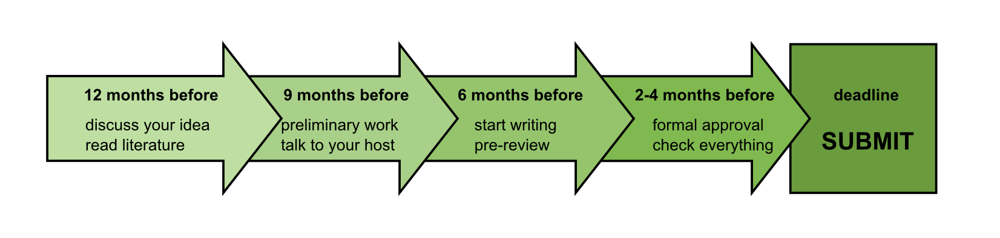

# Getting started with grant writing

Writing grant applications is both a science and an art. Like publishing and presenting, it is one of the key skills to make your science recognized and keep it going. But how to start writing an application? After working through a pile of literature on grant writing, in particular **“The Art of Grantsmanship”** by Jakob Kraicer [www.hfsp.org/funding/art-grantsmanship](http://www.hfsp.org/funding/art-grantsmanship), I have identified three main points to consider when you prepare for a grant application.

## 1. Start early

Grant writing takes time. It is not so much the writing itself that is most time-consuming. Figuring out what exactly you are going to do is a thought process that needs several rounds of evaluation by yourself and by people that are helping you. Also, grants involve paperwork like official permissions and reference letters. Allocating enough time for them is crucial, because a missing document e.g. due to a professor being abroad may spell a premature end to your application. As a rule of thumb, you may consider starting a year in advance good timing [1]. Also see the timeline in [2]. Fortunately, a year does not mean a year of full-time work. Even working on several applications in parallel is well feasible.

## 2. Talk to your host

Talking to your future host laboratory is necessary to answer essential questions: Is the place really interesting for you? Can you imagine living there? Who will support your application? Is the chemistry between you and your future PI working? Can you visit the place for some time in advance? Can you not only establish a scientific contact, but create evidence of your cooperation? Consider a statement like:

*"We already did an experiment together showing the connection between X and Y."* 

Preliminary data will provide strong support for your application.

## 3. Find the right call

The available grant calls differ a lot, and details often matter. You need to investigate the available funding bodies for suitable calls. Your task is to find a call to which you are not only formally eligible, but also where your application fits to the mission of the funding body. This is why it is not a good idea to copy-paste an application and simultaneously send it to several funding bodies. To get a feeling what ideas have a chance of funding, browse the list of already funded projects. The best thing you can do is to lay your hands on the text of a successful application. Ask around!

Starting early, talking to your host, and figuring out where to apply gives you a good foundation for writing a powerful application. 

## References

[1] Jakob Kraicer, The Art of Grantsmanship [www.hfsp.org/funding/art-grantsmanship](http://www.hfsp.org/funding/art-grantsmanship).

[2] Tutis Vilis and Jane Rylett, guidelines for applicants.
