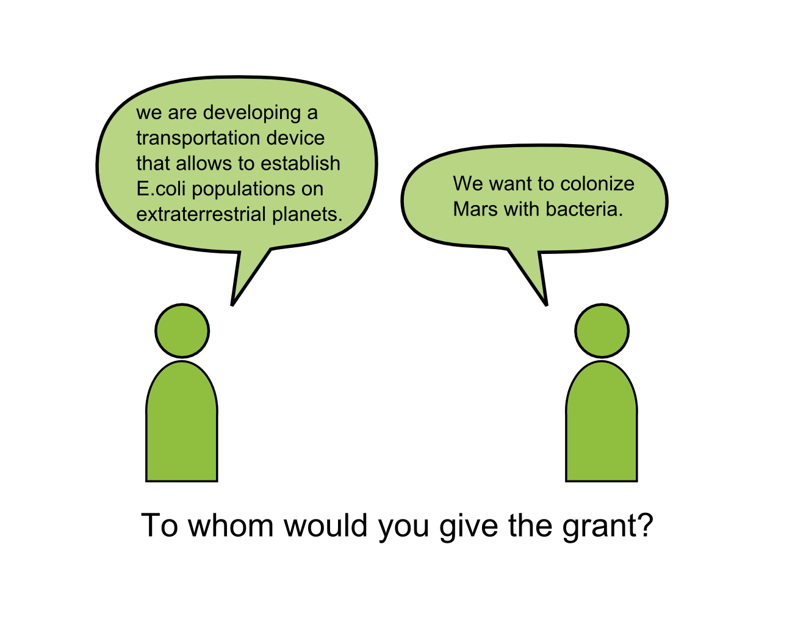

# Grant writing is marketing science

The big question in grant writing is: 

*“How to convince the funding body to give you money?”* 

Effectively this means marketing your science, similar to the way businesses market their products. To get a funding body to “buy” what you have to offer, you obviously need to have a solid product: good science. 

But good science alone is not enough, because the people deciding over funding do not automatically perceive the value in your work. As an applicant, you are responsible for communicating the value of your work. Blaming reviewers for not understanding what you do does not help. Giving logical arguments does not help either, because logic gets boring quickly or incites counter-arguments. To convince, you need to arouse emotions, for instance interest, curiosity, and respect for your work in the people deciding about your application.

One persuasive strategy is to **lead with emotion, then support by logic**. At the beginning of your text, state clearly the problem you are solving and the solution. Being enthusiastic is important, because most likely it will radiate throughout your entire application. After that, provide facts that explain why your project is likely to succeed. You may show the value of your work bluntly:

*“This project is novel, because nobody has ever applied method X on Y.”* 

or 

*“The cooperation with group Z is bound to be successful; we already have submitted a joint article on Q.”*

Sentences like these help reviewers to create their report.
